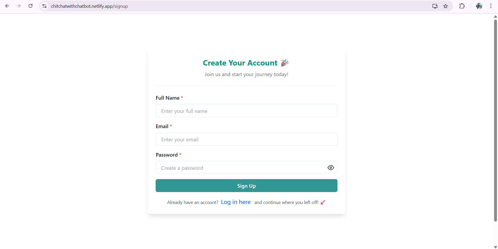
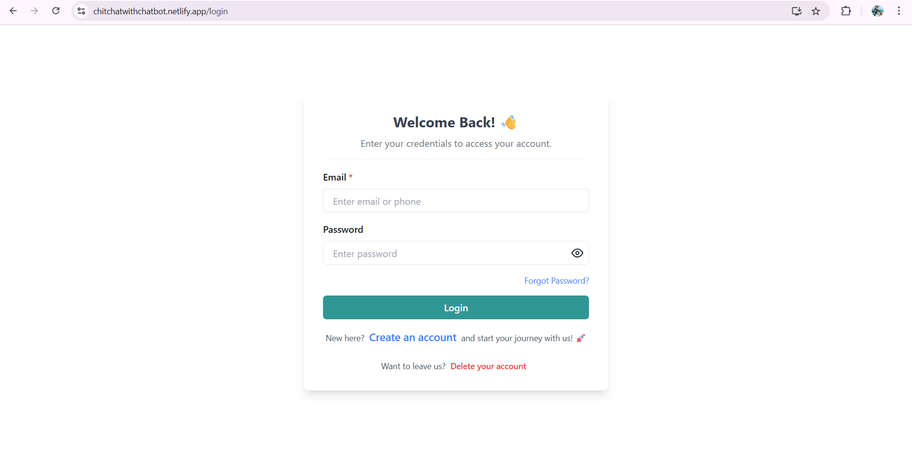
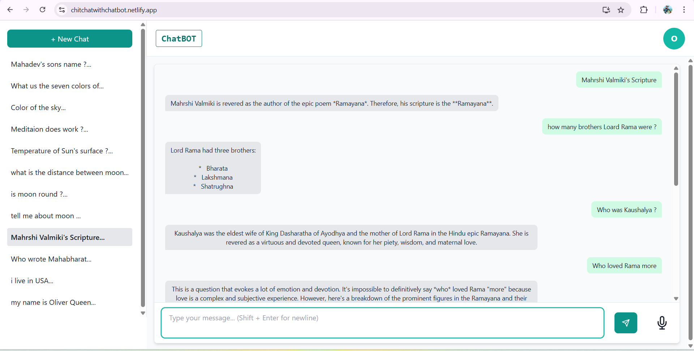
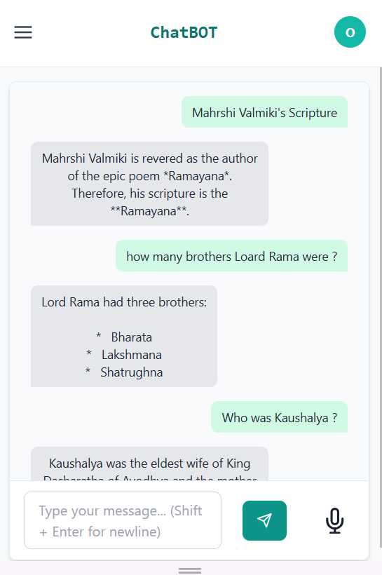
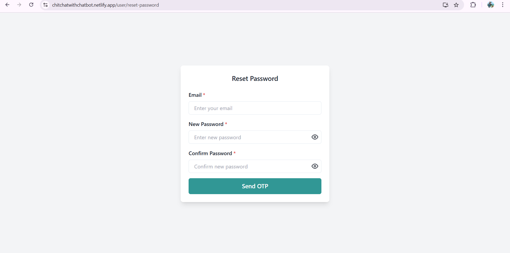
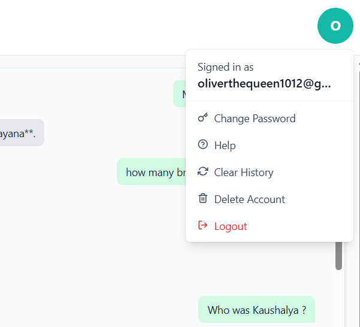
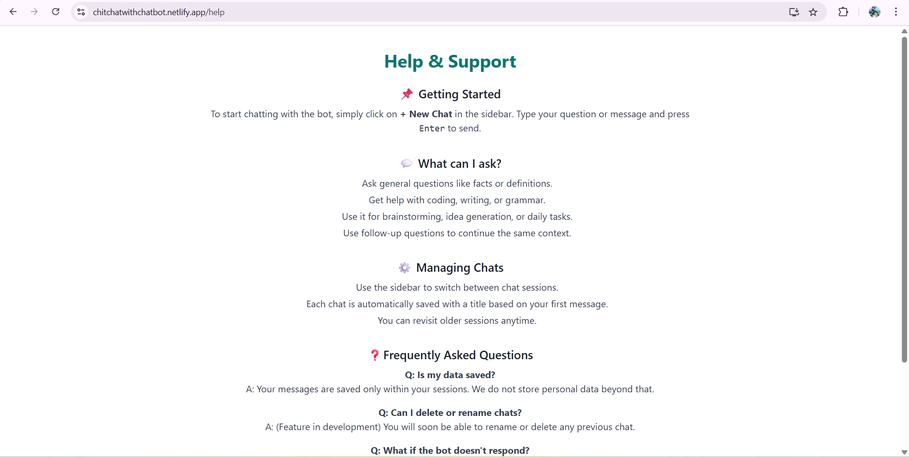
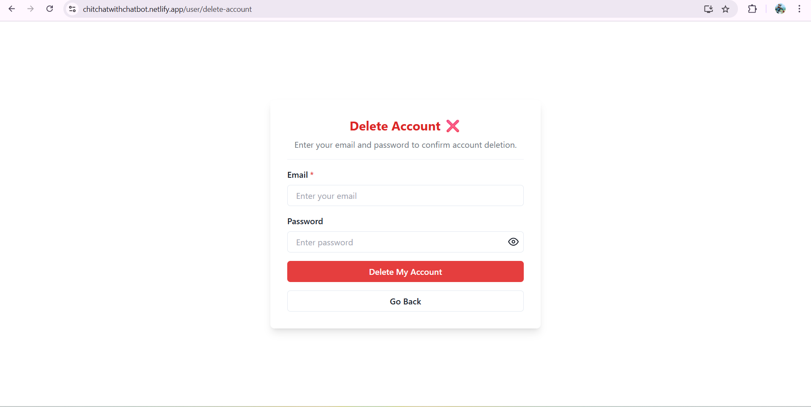

# 🤖 Chatbot

A web application where users can create an account and chat with Gemini AI using text or voice. All chats are saved and accessible from any device.

---

## ✨ Features

- 🔐 User authentication (Signup/Login with OTP)
- ✅ Email verification with OTP
- 🔁 Password reset via email
- 🧠 Chat with Gemini AI
- 💬 Voice input support
- 🗂️ Chat history saved in MongoDB
- 🧾 Multi-session support
- 🗑️ Delete chat history or account
- 📱 Responsive design (mobile/tablet friendly)
- 🙋 Help & Support page

---

## 🛠️ Tech Stack

### Frontend
- React + TypeScript
- Chakra UI + Tailwind CSS
- Redux Toolkit
- Axios

### Backend
- Node.js + Express
- MongoDB (Atlas) via Mongoose
- JWT for Authentication
- Nodemailer for Email
- Gemini AI API

---

## 🚀 Deployment

| Component | Platform |
|-----------|----------|
| Frontend  | [Netlify](https://chitchatwithchatbot.netlify.app/) |
| Backend   | Render |
| Database  | MongoDB Atlas |

---

## 📷 Screenshots

> Screenshots are stored in the `screenshots/` folder at the root of this repo.

| Description              | Preview                                  |
|--------------------------|------------------------------------------|
| Signup Page              |      |
| Login Page               |        |
| Dashboard (Large)        |  |
| Dashboard (Mobile)       |  |
| Reset Password           |  |
| User Menu                |  |
| Help and Support         |  |
| Delete Account           |  |

---

## 🔧 Installation Instructions

### 🔧 Install Frontend

- cd client
- npm install
- npm start

---

### 🔧 Install Backend

- cd ../server
- npm install
- npm run dev

---

### Run both Frontend & Backend (if configured)
npm run serve (root folder of repo)

---

## 🔐 Environment Variables

### Frontend (.env)

- REACT_APP_SERVER_ADDRESS = https://example.com (for prod)
- REACT_APP_SERVER_ADDRESS = http://localhost:300 (for local)

### Backend (.env)

- mongoUrl=mongodb+srv://example.com$true&w=majority&appName=Cluster0
- rounds=5
- JWT_SECRET=examplesecret
- tokenExpiry=1d
- GEMINI_API_KEY=exampleapisecret
- SMTP_USER=example@gmail.com
- SMTP_PASS=exam plex exam plew

## 🧭 API Endpoints

### 🔑 account/ – User Authentication

- POST /sendotp – Send OTP for email verification
- POST /verifyotp – Verify OTP from email
- POST /login – Login with credentials
- POST /send-reset-otp – Send password reset OTP
- POST /reset-password – Reset user password
- Example: https://chatbotexample.com/api/account/login

### 🤖 chatbot/ – Gemini AI Chat

- POST /ask – Send message to Gemini AI
- Example: https://chatbotexample.com/api/chatbot/ask

### 💬 chat/ – Chat Sessions

- POST /new-session – Create a new chat session
- GET /sessions – Get all chat sessions
- PATCH /session/update – Update session title
- DELETE /session/delete – Delete chat session
- Example: https://chatbotexample.com/api/chat/new-session

### 📩 message/ – Messages in a Session

- GET /session/:sessionId – Get all messages of a session
- POST /add – Add message to a session
- Example: https://chatbotexample.com/api/message/session/1

## 📐 Architecture Diagram

                                  🌐 User Browser
                                         │
              ┌──────────────────────────┴──────────────────────────┐
              │                                                     │
      📱 Voice Input (Web API)                                🖱️ UI Interaction
              │                                                     │
              └─────────────► React Frontend (TypeScript + Chakra UI + Tailwind)
                                 │       │       │         │
          ┌──────────────────────┘       │       └─────────┬──────────────┐
          │                              ▼                 ▼              ▼
  🔐 Auth Module             🎤 Voice-to-Text         📄 Session Manager   🌍 Routing (SPA)
  - Login/Signup             - Web Speech API        - Start/Continue    - Help Page
  - OTP UI & Token Storage   - Voice Commands        - History Viewer    - Error Page

                                 │
                                 ▼
                          🌐 Axios REST Calls
                                 ▼
               ┌────────────────────────────────────────┐
               │    🛠️ Node.js + Express Backend (TS)     │
               │────────────────────────────────────────│
               │  ◾ Controller Layer                     │
               │  ◾ Middleware (Auth, RateLimit, Logger) │
               │  ◾ Service Layer (Chat, OTP, Session)   │
               │  ◾ DTOs + Zod Validation                │
               │  ◾ Configured for `.env` usage          │
               └──────────────┬──────────────┬───────────┘
                              │              │
                              ▼              ▼
     ┌────────────────────┐      ┌────────────────────┐
     │ 📧 Nodemailer       │      │ 🧠 Gemini AI (Google) │
     │ - Send OTP Email    │      │ - AI Chat Interface  │
     │ - Reset Password    │      │ - Prompt Chaining    │
     └────────────────────┘      └────────────────────┘
                              │
                              ▼
                   ┌─────────────────────────────┐
                   │   🗃️ MongoDB Atlas (Mongoose) │
                   │─────────────────────────────│
                   │ - Users                      │
                   │ - Chat Sessions              │
                   │ - Messages                   │
                   │ - Audit Logs (optional)      │
                   └─────────────────────────────┘

🔄 Data Flow:
 - Voice/Text Input → React → API → Gemini → MongoDB → Frontend UI

🔐 Security:
 - JWT Tokens (HTTP-Only, AuthGuard)
 - Encrypted Passwords (bcrypt)
 - Rate Limiting, CORS, Helmet (optional)

🛠 DevOps / Deployment:
 - Frontend: Netlify (CI from GitHub)
 - Backend: Render (Auto Deploy from GitHub)
 - Database: MongoDB Atlas (Cloud Hosted)
 - ENV Secrets:
   - `GEMINI_API_KEY`
   - `SMTP_USER`, `SMTP_PASS`
   - `JWT_SECRET`
   - `MONGODB_URL`

🚀 Future Enhancements (scalable setup):
 - ⛓️ Redis for Caching Responses
 - 📈 Winston/Morgan for Logging
 - ☁️ S3 for Chat Media (images/audio)
 - 📊 Admin Dashboard for Analytics


## 🌐 Live Demo
🔗 https://chitchatwithchatbot.netlify.app/


## Clone the repository
```bash
git clone https://github.com/Pannakbhushana/zerocode-fe-assignment.git


